<div align="center">


# Shelf

A minimal, good-looking desktop library for your Steam, Epic Games, GOG and Ubisoft games.

[](https://github.com/0xby7eMe/shelf/actions/workflows/build.yml)
[](https://github.com/0xby7eMe/shelf/releases)

</div>

```bash
curl -fsSL https://raw.githubusercontent.com/0xby7eMe/shelf/main/install.sh | bash
```

<p align="center">Linux (x86_64) and macOS (Apple Silicon and Intel). Arch gets the native binary, other Linux systems the AppImage, a Mac Shelf.app. <a href="#install">More install options</a></p>

<p align="center">
  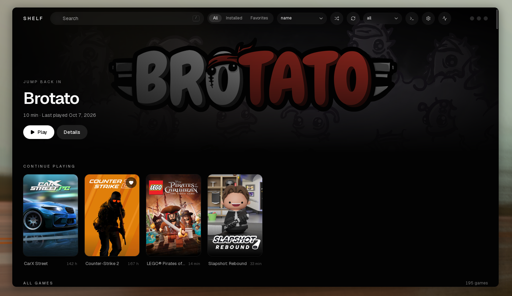
</p>

<p align="center">
  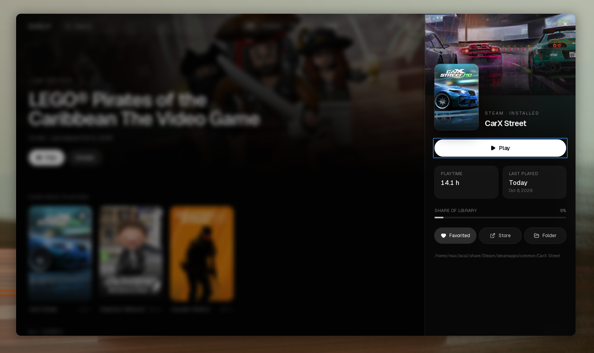
  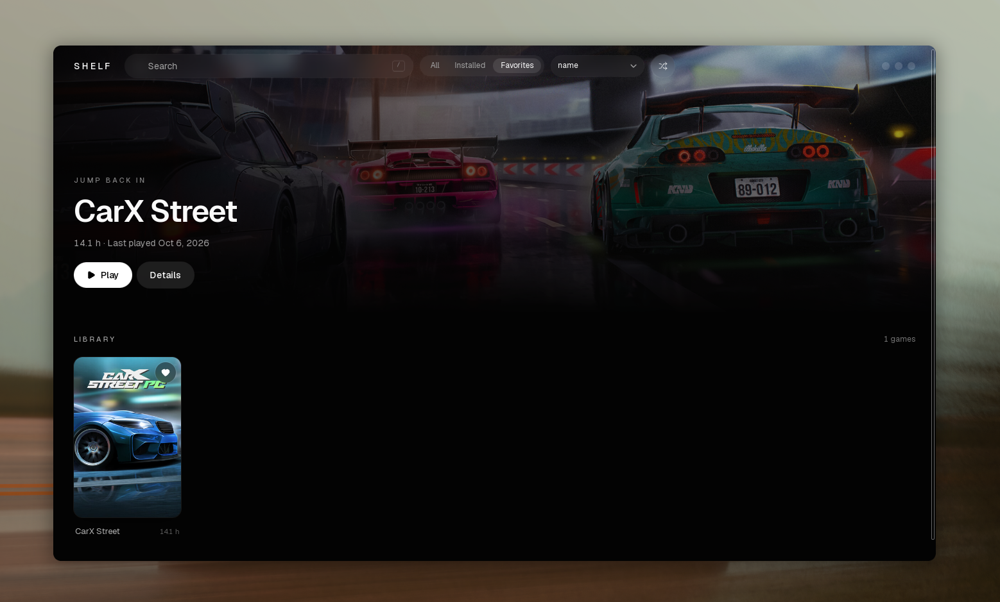
</p>

## Install

### Quick install

```bash
curl -fsSL https://raw.githubusercontent.com/0xby7eMe/shelf/main/install.sh | bash
```

The script installs the latest release for your user, with no root needed. It picks the right build for your system, checks its SHA-256, and adds Shelf to your application menu:

- **macOS** gets `Shelf.app` (`shelf-macos-universal.zip`) in `~/Applications`, for Apple Silicon and Intel Macs. See [macOS](#macos).

- **Arch, Manjaro, EndeavourOS and other Arch-based distros** get the native binary (`shelf-arch-x86_64.tar.gz`), built on Arch against the system GTK and WebKitGTK.
- **Ubuntu, Debian, Fedora and everything else** get the AppImage (`shelf-linux-x86_64.AppImage`), with GTK and WebKitGTK bundled.

On Linux, Shelf ends up in `~/.local/bin/shelf`. Run the installer again to update. Options go after `bash -s --`:

```bash
curl -fsSL https://raw.githubusercontent.com/0xby7eMe/shelf/main/install.sh | bash -s -- --version v1.2.3
curl -fsSL https://raw.githubusercontent.com/0xby7eMe/shelf/main/install.sh | bash -s -- --appimage   # AppImage even on Arch
curl -fsSL https://raw.githubusercontent.com/0xby7eMe/shelf/main/install.sh | bash -s -- --uninstall  # keeps your settings
```

Only x86_64 Linux builds are published for Linux. For a Mac, see [macOS](#macos).

### Manual download

Everything is on the [releases page](https://github.com/0xby7eMe/shelf/releases).

**Arch:** `shelf-arch-x86_64.tar.gz` needs GTK 3 and WebKitGTK 4.1:

```bash
sudo pacman -S gtk3 webkit2gtk-4.1
tar -xzf shelf-arch-x86_64.tar.gz
install -Dm755 shelf ~/.local/bin/shelf
install -Dm644 appicon.png ~/.local/share/icons/hicolor/512x512/apps/io.github.0xby7eme.shelf.png
install -Dm644 shelf.desktop ~/.local/share/applications/shelf.desktop
```

**Ubuntu, Debian and others:** `shelf-linux-x86_64.AppImage` runs on Ubuntu 22.04 and later, Debian 12 and most other distros. Nothing else needs installing, except FUSE 2 (`sudo apt install libfuse2`) on systems that lack it:

```bash
chmod +x shelf-linux-x86_64.AppImage
./shelf-linux-x86_64.AppImage
```

### macOS

The [quick install](#quick-install) command works on a Mac too and puts **Shelf.app** in `~/Applications`. It runs on Apple Silicon and Intel Macs with macOS 11 or later. Run it again to update, or with `--uninstall` to remove Shelf.

You can also download `shelf-macos-universal.zip` from the [releases page](https://github.com/0xby7eMe/shelf/releases) and move **Shelf.app** to Applications yourself. Shelf isn't signed with an Apple developer certificate, so macOS refuses the first start of a downloaded copy. Either right-click Shelf.app, choose **Open** and confirm, or run once:

```bash
xattr -dr com.apple.quarantine /Applications/Shelf.app
```

On a Mac, Shelf does less than on Linux, because there is no Proton to run Windows games:

| | macOS |
| --- | --- |
| Steam | Everything: library, play time, now playing, launching and installing through Steam |
| Epic Games | Library, and games with a Mac version install and run natively through legendary, which Shelf can install for you. No cloud saves yet |
| GOG | Library and store pages. Installing needs GOG Galaxy for now |
| Ubisoft | Not available: Ubisoft Connect runs through Proton |
| Hardware monitor, menu entries, `shelf://` links, tray icon | Not available |
| Updates | Shelf says when a new version is out; download it from the release page |

Settings and data live in `~/Library/Application Support/shelf`, and downloaded art in `~/Library/Caches/shelf`.

To build it on a Mac, install Go, Node and the Wails CLI, then run `make build` (a universal `build/bin/Shelf.app`) or `make install` (copies it to Applications).

### Requirements for the games

For Epic Games you also need legendary, which Shelf can install for you (see [Epic Games](#epic-games)), and a Proton build from Steam or ProtonUp-Qt. GOG and Ubisoft need only a Proton build, and Shelf can install GE-Proton for you from the Ubisoft tab.

Controller support relies on WebKitGTK being built with gamepad support (libmanette), which is the case on Arch.

### From source

Requires Go 1.25+, Node 18+ and the [Wails CLI](https://wails.io), plus the development packages:

```bash
# Arch
sudo pacman -S gtk3 webkit2gtk-4.1
# Debian/Ubuntu
sudo apt install libgtk-3-dev libwebkit2gtk-4.1-dev
```

```bash
git clone https://github.com/0xby7eMe/shelf
cd shelf
cd frontend && npm install && cd ..
make install
```

`make install` builds the app and installs the binary, icon and launcher entry for your user.

## Features

**Library**

- Reads your Steam library from its local files. No login needed. An optional Steam Web API key adds the games you own but haven't installed, and more (see [Steam](#steam)).
- Your Epic Games library alongside it, after a one-time sign-in (see [Epic Games](#epic-games)).
- Your GOG library, after a one-time sign-in (see [GOG](#gog)).
- Your Ubisoft library too, read from Ubisoft Connect once you've signed in there (see [Ubisoft](#ubisoft)).
- Poster grid with instant search, installed and favorites filters, a store filter and sorting. Stays smooth with a couple of hundred games.
- Hero banner for the game you played last, plus "Continue playing" and "Never played" shelves
- Detail sheet with playtime, last played, share of your library, store page and install folder
- Favorites and a random game picker
- **Collections and tags** of your own, to filter the library by (see [Collections and tags](#collections-and-tags))
- **Live library:** installs, uninstalls and playtime update automatically
- **Now playing:** a header indicator with a session timer
- **Activity:** a play-time heatmap and weekly stats, recorded while Shelf is running
- **Share card:** an image of your library to post anywhere, with your hours, counts per store and most played games (see [Share card](#share-card))
- **Friends:** who is online and what they are playing, for the launchers that allow it (see [Friends](#friends))
- **Achievements:** your progress per game and across the library, for the launchers that allow it (see [Achievements](#achievements))
- **Appearance:** choose the poster size and the interface size, which home sections show, and reduce motion (see [Appearance](#appearance))
- **Update notifier:** Shelf tells you when a new release is out and can install it for you (see [Updates](#updates))

**Epic Games**

- Install, update, verify, repair and uninstall games without leaving Shelf
- Launch through Proton with a separate prefix per game
- Cloud saves, per-game launch settings, and import of games you already have installed

**GOG**

- Your whole GOG library, installed or not, with GOG's poster and banner art
- Install and uninstall from Shelf, with GOG's own offline installers run silently through Proton, in the same download queue as Epic games
- Each game runs in a Proton prefix of its own, with no extra tools to install

**Ubisoft**

- Your whole Ubisoft library, installed or not, with Ubisoft's own poster and banner art
- Install, play and uninstall through Ubisoft Connect, which Shelf sets up and runs in its own Proton prefix
- Install progress, launch errors that say what went wrong, and a hint when the library is empty
- GE-Proton and the BattlEye runtime can be installed from Shelf with one button

**Everything else**

- Controller navigation with soft interface sounds, drawn with the buttons of your controller (Xbox, PlayStation or Nintendo)
- One **Integrations** page with a tab per store
- **Desktop integration:** application menu entries, `shelf://` links and a tray icon (see [Desktop integration](#desktop-integration))
- An optional **hardware monitor** with live CPU, memory, disk, network and GPU graphs (see [Hardware monitor](#hardware-monitor))
- A download queue, a disk usage view, and a log window
- Frameless glass UI, dark only

<p align="center">
  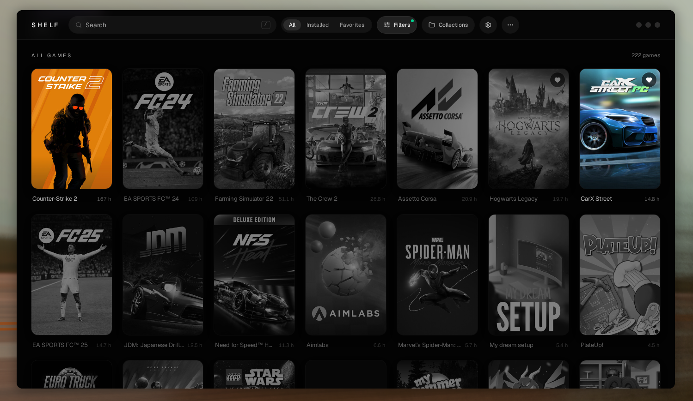
</p>

<p align="center">
  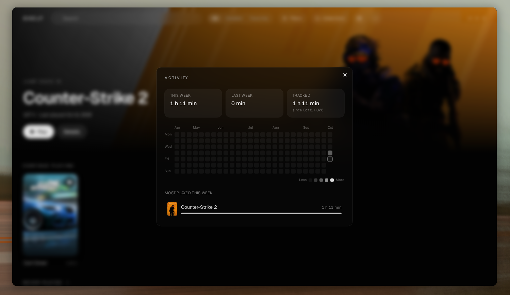
  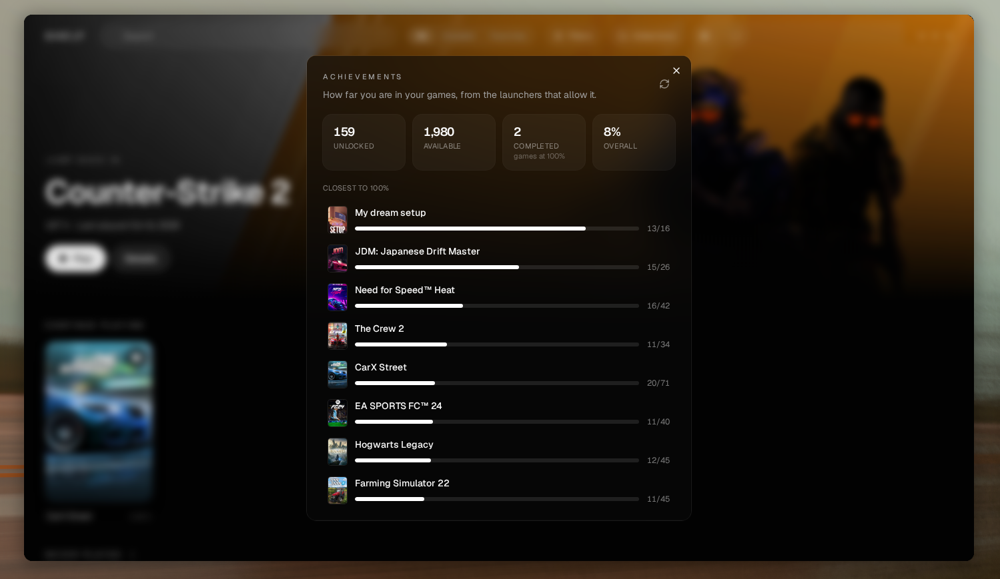
</p>

## Steam

Out of the box Shelf reads Steam's own files, which only know about installed games. A free **Web API key** fills in the rest. Open **Settings, Integrations, Steam**, paste your key and press **Connect**. Get one at [steamcommunity.com/dev/apikey](https://steamcommunity.com/dev/apikey); any domain name works when it asks, for example `localhost`.

With a key:

- **Every game you own** is listed, installed or not, with Steam's own art. **Install in Steam** opens Steam's install dialog for the ones you don't have.
- **Play time and last played** use the larger of what Steam's files and the Web API report, so they are right even for games you removed.
- **An account card** shows your profile, Steam level, number of games owned and played, total play time and the last two weeks.
- **Friends** (see [Friends](#friends)).

The key is kept in `~/.config/shelf/steam.json`, readable only by you, and is only ever sent to Steam. **Disconnect** forgets it, and the games that aren't installed leave the library. If Steam says your game details are private, Shelf tells you; set **Game details** to Public in Steam's privacy settings. The list of owned games is kept for ten minutes between scans, and an older copy is used when Steam can't be reached.

## Epic Games

Shelf drives [legendary](https://github.com/legendary-gl/legendary), the same CLI Heroic uses. If it isn't installed, the **Epic Games** tab has an **Install legendary** button: Shelf downloads legendary's standalone build for your system from its GitHub releases (it needs no Python), checks it against GitHub's SHA-256 and keeps it in Shelf's own folder (`~/.config/shelf/bin`, or `~/Library/Application Support/shelf/bin` on a Mac). A legendary from your package manager or on your `PATH` (Arch: `pacman -S legendary`) is used first. To install it by hand, download the `legendary_<system>_<cpu>` file from the [latest release](https://github.com/legendary-gl/legendary/releases/latest), `chmod +x` it and put it in your `PATH`. Shelf keeps its own legendary login, separate from any existing one.

1. Click the gear in the header, open **Integrations** and pick the **Epic Games** tab. Choose **Open Epic login**, sign in and paste the code Epic shows you.
2. Your Epic games appear in the library. Open one and press **Install**.
3. **Play** runs the game with Proton. Shelf finds Proton in Steam, `compatibilitytools.d` (GE-Proton) and Heroic's tools folder. Pick a version in the settings; by default the newest GE-Proton wins, then Proton Experimental.

<p align="center">
  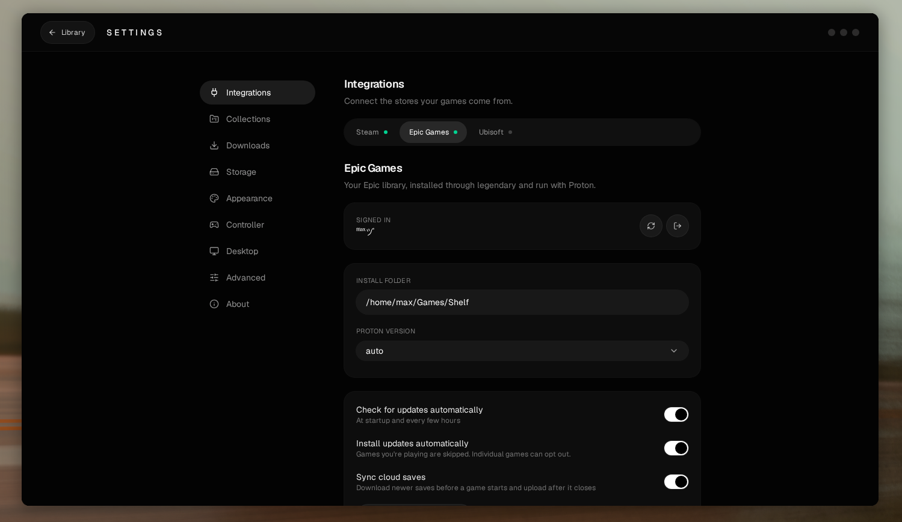
</p>

Games install to `~/Games/Shelf` (changeable), each with its own Proton prefix in `~/.local/share/shelf/prefixes`. Play time for Epic games is recorded while Shelf is running, since Epic doesn't provide it.

### Updates

Shelf checks for new versions at startup and every few hours, marks games that are behind and can install updates by itself. Both are switches in the Epic settings, and each game can opt in or out. Epic refuses to start an outdated game, so Shelf tells you when an update is needed. A game can also be allowed to launch outdated.

### Verify and repair

Check a game's files against Epic's manifest from its sheet. If anything is damaged or missing, repair downloads just those files again.

### Cloud saves

Newer saves are downloaded before a game starts and uploaded after it closes, or synced by hand from the sheet. Shelf finds the save folder inside the game's Proton prefix, and you can override it per game. A game has to be started once before its saves can sync. Only games that support cloud saves show the option.

### Per-game settings

Proton version, launch arguments, environment variables, MangoHud, GameMode, offline mode, whether outdated launches are allowed, and update and cloud save behavior. Each can follow the global setting.

### Existing installs

Games already installed by Heroic, legendary or the Epic Games Launcher are found and imported in place, with no download. Shelf only offers games that belong to your account.

### Games that can't be installed

Some Epic titles, such as Ubisoft Connect and EA app games, have to be installed through their own launcher, and Epic doesn't let other launchers download them. Shelf marks these in the game sheet instead of offering an install that can't work. If the game is also in your Ubisoft library, install it from there (see [Ubisoft](#ubisoft)).

## GOG

Shelf talks to GOG directly, so there is nothing extra to install besides Proton.

1. Click the gear, open **Integrations** and pick the **GOG** tab. Press **Open GOG login** and sign in on GOG's site.
2. GOG then shows an almost empty page. Copy that page's whole address (it contains `code=`), paste it into Shelf and press **Connect**. Your GOG games appear in the library.
3. Open a game and press **Install**. Shelf downloads GOG's offline Windows installer into the download queue, checks every file against GOG's checksum, then runs the installer silently through Proton. Its files are deleted once the game is installed. A cancelled download carries on where it stopped.
4. **Play** starts the program the game's own `goggame-<id>.info` names, through Proton. **Uninstall** deletes the game's folder.

GOG games use the install folder and Proton build from the Epic Games tab, which the GOG tab shows too. Each game gets its own prefix in `~/.local/share/shelf/prefixes/gog-<id>`. The login is kept in `~/.config/shelf/gog.json`, readable only by you, and is only ever sent to GOG. Play time is recorded while Shelf is running, as with Epic.

## Ubisoft

Ubisoft has no command line tool like legendary, and its web login sits behind a bot check that only a real browser passes, so Shelf never asks for your Ubisoft password. Instead, [Ubisoft Connect](https://www.ubisoft.com/en-us/ubisoft-connect) itself is the account: Shelf installs it into a Proton prefix of its own, you sign in there once, and Shelf reads the library Connect records.

1. Click the gear, open **Integrations** and pick the **Ubisoft** tab. Press **Set up Ubisoft Connect**. Shelf downloads Ubisoft's installer and runs it quietly with Proton.
2. Press **Open Ubisoft Connect** and sign in, two-step verification included. Your games appear in Shelf on their own once Connect has loaded them. Until then the Ubisoft filter explains what is missing.
3. Open a game and press **Install**. Shelf hands the download to Connect and shows the game as installing, with how much has been written to disk (Connect reports no percentage). It counts as installed only when Connect marks it finished.
4. **Play** starts the game through Connect. If a game doesn't appear within two minutes, or Proton can't hand it over, Shelf says so and points at the game's log. **Uninstall** asks Connect to remove it; you confirm in Connect's window.

Games Ubisoft lists but that belong to Steam are shown in the library and left to Steam.

### GE-Proton

Ubisoft Connect behaves best with GE-Proton: black or frozen windows and slow game starts are the usual symptoms of other builds. If you aren't using it, the Ubisoft tab has an **Install GE-Proton** button. Shelf fetches the newest release from GitHub, checks its SHA-512, unpacks it into Steam's `compatibilitytools.d` (or Heroic's folder without Steam) and uses it from then on, unless you picked a build yourself. If Connect misbehaves after switching, **Reset** gives it a fresh prefix.

### BattlEye

Games that use BattlEye, such as Riders Republic, need Proton's BattlEye runtime to start. Shelf detects them from the game's folder, sets `PROTON_BATTLEYE_RUNTIME` when starting them (Epic games too), and refuses to launch them without it, saying what to do. The game's page offers **Install BattlEye runtime**, and so do the Epic and Ubisoft tabs. Steam's own "Proton BattlEye Runtime" is used if you have it. Otherwise Shelf downloads the same files Heroic and Lutris use, a 9 MB archive pinned to a known SHA-256, into `~/.local/share/shelf/runtimes`.

### Connect's window

Many setups draw Connect's own window black. **Fix a black Ubisoft Connect window** (on by default) uses software rendering for Connect's window only while you sign in and install. Playing a game restarts Connect normally, so games never use it.

## Downloads and storage

Installs, updates and repairs run one at a time. **Settings, Downloads** shows the queue: reorder it, send a game to the front, cancel entries or pause the queue. "Update all" queues every outdated game.

Ubisoft downloads are done by Connect, so they aren't in this queue; they show as installing on the game instead.

**Settings, Storage** shows how much space each Steam, Epic and Ubisoft game uses, free space per disk, and Proton prefixes, including leftovers from uninstalled games that you can delete. Ubisoft's games are installed inside one shared Connect prefix, so that is listed on its own with the games' space taken off, and is never offered as a leftover: **Reset** there deletes Connect's login and every Ubisoft game, and says so first.

<p align="center">
  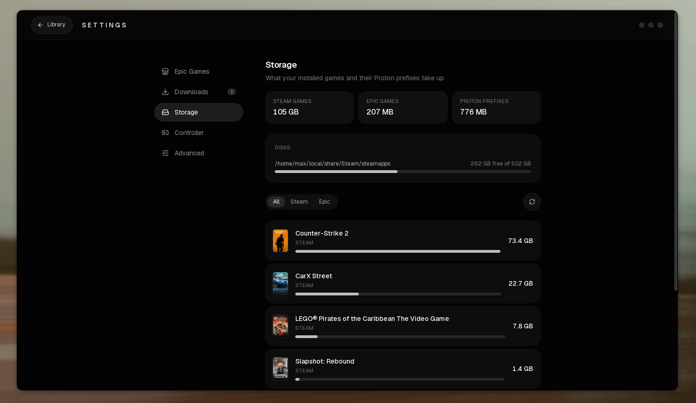
</p>

## Appearance

**Settings, Appearance** makes Shelf look the way you like. Everything applies at once and is kept on this computer.

- **Poster size:** small, medium or large, for the library grid and the shelves.
- **Interface size:** 90%, 100%, 110% or 125%, which scales text and spacing together, for small screens or a TV.
- **Home:** show or hide the banner for your last played game, the **Continue playing** shelf and the **Never played** shelf. Without the banner, that game is listed on the shelves like any other.
- **Reduce motion:** turns off animations. It starts on when your system asks for less motion.

**Reset appearance** puts everything back.

<p align="center">
  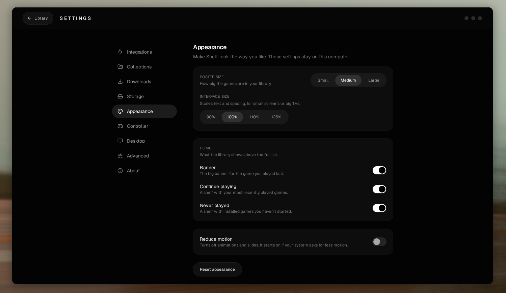
</p>

## Collections and tags

Open a game and use **Collections** and **Tags** in its sheet. A game can be in any number of collections (press **New collection** to make one on the spot) and carry any number of tags; type a tag and press Enter or a comma. The **Collections** button in the header narrows the library to one collection or tag, and works together with the store filter, search and the Favorites tab. **Settings, Collections** renames and deletes collections and removes a tag from every game.

Everything is saved in `~/.config/shelf/organizer.json`, separate from your favorites. Games are filed by store and id (`steam:620`, `epic:Fortnite`), so the same title on two stores can be filed differently.

## Share card

**More, Share card** draws a 1200×720 image of your library: total hours played, how many games you have per store, installed and favorite counts, and your five most played games with their covers. Press **Save as PNG** to put it wherever you like. The card holds only game titles, play time and counts, no paths, accounts or dates, and nothing is uploaded.

<p align="center">
  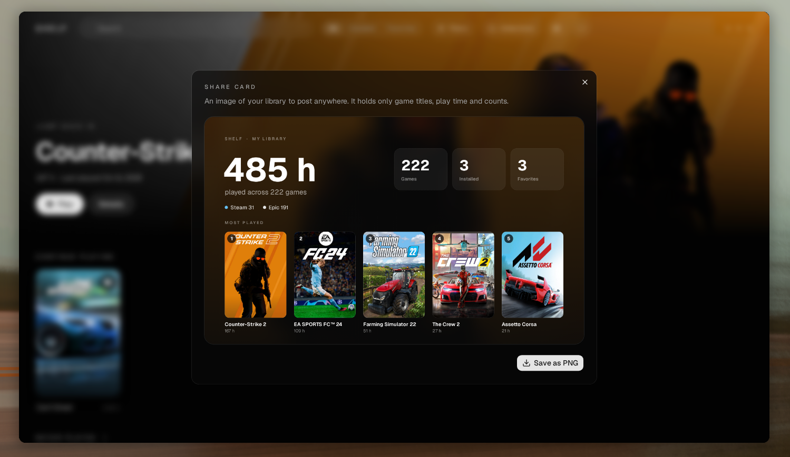
</p>

## Friends

**More, Friends** lists your friends by what they are doing: playing, online, away, and offline (folded away). A friend's game is matched against your library, so you can open it straight away if you own it. The list refreshes every minute while the window is open and never in the background.

| Launcher | Friends | Why |
| --- | --- | --- |
| Steam | Yes | Through Steam's Web API |
| Epic Games | No | Epic only shares who is online over a private channel that other apps can't use |
| GOG | No | Not supported by Shelf yet |
| Ubisoft | No | Ubisoft Connect has no way for other apps to read your friends |

Epic, GOG and Ubisoft are listed in the window with the reason, so you know why they are empty.

**Steam setup.** The friends list uses the same Web API key as the [Steam integration](#steam), so it is set up once under **Settings, Integrations, Steam**. Your friends list has to be visible to you in Steam's privacy settings, which it is by default.

New launchers plug in by implementing one small `Provider` interface in `internal/friends`; the window draws their setup form from the fields they declare.

## Achievements

**More, Achievements** shows how far you are across your library: achievements unlocked and available, games you completed, and the games closest to 100%. Open a Steam game and its sheet lists that game's achievements: the newest unlocks first, then what is still locked, easiest first, each with how many players have it. Shelf scans your played games in the background, a few at a time, and keeps the results for half a day so the window opens instantly.

| Launcher | Achievements | Why |
| --- | --- | --- |
| Steam | Yes | Through the Steam Web API key from [Steam](#steam) |
| Epic Games | No | Epic only serves achievements to a game's own developer, with credentials issued per game |
| GOG | No | Not supported by Shelf yet |
| Ubisoft | No | Ubisoft Connect has no public way to read them |

Epic, GOG and Ubisoft are listed in the window with the reason. For Steam, your **Game details** have to be public in Steam's privacy settings, and Shelf says so if they aren't. Like [Friends](#friends), each launcher is a small `Provider` in `internal/achievements`, so a store that gains an API later is one file.

## Updates

Shelf checks GitHub for a new release when it starts and once a day after that, and shows a notice when there is one. **Settings, About** shows the version you run, checks on demand and holds the switch to turn the automatic check off. For a new version you can read what changed, **Skip this version**, or press **Update now**:

- An **AppImage** or a binary you installed with the install script is replaced in place. Shelf downloads the right file for your system, checks its SHA-256, swaps it in and offers to restart.
- A copy installed by your package manager, or in a folder you can't write to, can't update itself. Shelf says so and opens the release page instead.
- A build from source never checks, since it has no release number.

Only the release files of this repository are ever downloaded. You can always update the way you installed: run the [install script](#quick-install) again.

## Desktop integration

**Settings, Desktop.** Everything is off until you switch it on.

- **Application menu entries** add every installed game to your launcher, kept up to date as games come and go. Shelf only ever removes entries it wrote itself.
- **`shelf://` links** make `shelf://launch/steam:620` or `shelf://launch/epic:Fortnite` start a game from a browser, script or anything that opens URLs. Only installed games can be started this way, and a link can't do anything else. Menu entries use the same links. Only one Shelf runs at a time: a second start hands its link to the running one.
- **Tray icon** shows recently played games with a click to start them. It uses the StatusNotifier protocol, so GNOME needs the AppIndicator extension. **Keep running in the tray** makes closing the window hide it; quit from the tray menu. Both apply at the next start.

## Controller

Plug in a gamepad and press any button (the window needs focus). Focus moves smoothly between games, and the interface plays soft sounds as you go.

Shelf tells which kind of controller you have, by its USB vendor id, and shows the buttons it really has: coloured A/B/X/Y for Xbox, ✕ ○ □ △ for PlayStation, and Nintendo's layout with A and B swapped. Anything unknown is treated as an Xbox pad.

| Action | Xbox | PlayStation | Nintendo |
| --- | --- | --- | --- |
| Move | D-pad / left stick | D-pad / left stick | D-pad / left stick |
| Select | `A` | ✕ | `B` |
| Back, or close the open dialog | `B` | ○ | `A` |
| Favorite | `X` | □ | `Y` |
| Random game | `Y` | △ | `X` |
| Switch tabs | `LB` / `RB` | `L1` / `R1` | `L` / `R` |
| Settings | Menu | Options | `+` |
| Search | View | Create | `−` |
| Scroll | Right stick | Right stick | Right stick |

The sounds are Steam's own Deck UI sounds, played from your Steam install (nothing is copied or bundled). Without Steam, Shelf uses a small built-in set instead. Navigation, sounds and volume are under **Settings, Controller**. Dialogs and menus trap the focus, so the controller never wanders behind them.

<p align="center">
  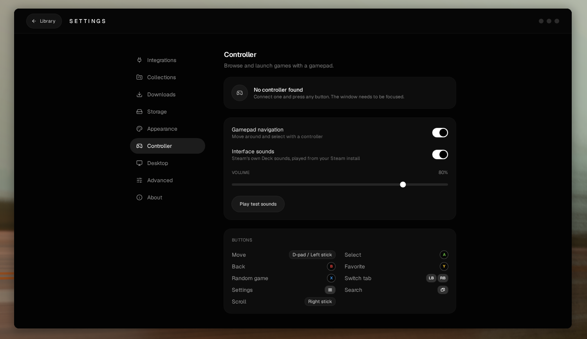
</p>

## Hardware monitor

A task-manager-style page for seeing what your machine is doing while you play. It's off by default: turn on **Hardware monitor** under **Settings, Advanced**, which adds **Performance** to the **More** menu (and `P` opens it). Nothing is sampled while the page is closed.

- **CPU:** utilization over the last minute, overall or per logical processor, with clock speed, temperature, processes, threads, load average and uptime
- **Memory:** usage, what is cached and could be reclaimed, free memory and swap
- **Disks:** active time, read and write speed, temperature and the space left on each mount
- **Network:** send and receive speed per adapter, with its link speed and addresses. Only real adapters are listed, not bridges or containers
- **GPUs:** utilization, video memory, temperature, power and clock for AMD (read from the kernel) and NVIDIA (through `nvidia-smi`). Intel shows its clock. A card that has powered itself down to save energy is shown as such and isn't woken to take a reading. An NVIDIA card that is awake stays awake while the page is open

Everything is read from `/proc` and `/sys`, once a second, so it needs no extra tools. Temperatures appear when the kernel has a sensor for them.

<p align="center">
  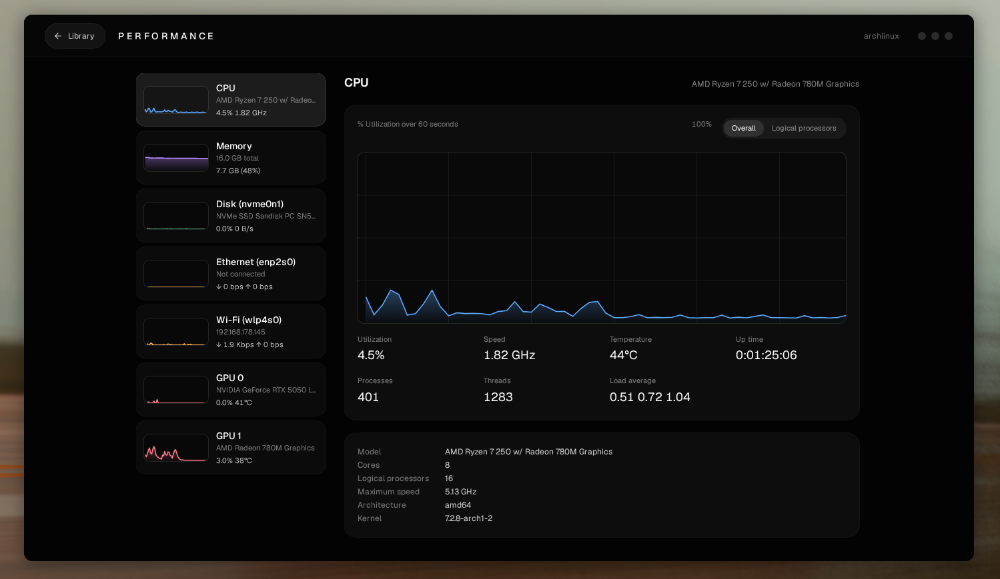
</p>

## Log window

**Settings, Advanced** turns on a log window: a console along the bottom of the window with live output from downloads, updates, game launches and cloud saves, including the commands that were run. Filter it, copy it or clear it. It opens by itself when a game fails to start. Each game's launch output is also written to `~/.local/share/shelf/logs`, whether or not the window is on.


## Keyboard

| Key | Action |
| --- | --- |
| `/` | Focus search |
| `Esc` | Clear search, or leave the settings page or hardware monitor |
| `R` | Open a random game from the current view |
| `P` | Open or close the hardware monitor, once it is turned on |

## Development

```bash
make dev      # run with hot reload
make icon     # render build/appicon.png from build/appicon.svg
make build    # production binary in build/bin/ (renders the icon first)
go test ./internal/...
```

## How it works

**Steam.** Shelf parses Steam's own files: `libraryfolders.vdf` for your library locations, the `appmanifest_*.acf` files for installed games and `localconfig.vdf` for playtime. A file watcher reloads the library when they change. Cover and hero art come from Steam's local library cache, with the Steam CDN as a fallback. "Now playing" looks for Steam's `SteamLaunch` wrapper process in `/proc`.

**Epic.** Shelf runs legendary with its own config folder and reads its files for the library and installed games. Games start as `legendary launch` with Proton as the wrapper, with `STEAM_COMPAT_DATA_PATH` pointing at the game's own prefix. Legendary exits right after starting the game, so "now playing" finds the game by the `-epicapp=<name>` argument on its processes. Downloads are one legendary process at a time, with progress read from its output.

**GOG.** Shelf signs in with the same login GOG Galaxy uses and keeps its refresh token. The library is GOG's account product list, with posters and banners from GOG's GamesDB. An install fetches the Windows installer files named by GOG's product API, resuming partial files with HTTP ranges and checking each against GOG's MD5, and runs the installer as `proton run setup.exe /VERYSILENT /DIR=…` in the game's own prefix. The game's `goggame-<id>.info` says which program to start. Since each GOG game has a prefix of its own, any process running in it means the game is running.

**Ubisoft.** Shelf runs Ubisoft Connect through Proton in its own prefix and reads what Connect writes there: `cache/configuration/configurations` (every game it knows, with names and art) and `cache/ownership/<account id>` (the ids your account owns), both protobuf. The library is the games in both. Poster and banner art come from Ubisoft's launcher CDN. Install, uninstall and play are `uplay://` links handed to Connect through `proton run start`. Connect's registry marks the start of a download with an `Installs` key and its end with an `Uninstall` key, which is how Shelf tells installing from installed. Games are found running by their install folder in the process list.

Finished sessions of every store feed the activity heatmap.

| Data | Location |
| --- | --- |
| Favorites | `~/.config/shelf/favorites.json` |
| Play sessions | `~/.config/shelf/sessions.json` |
| Steam Web API key | `~/.config/shelf/steam.json` |
| Update settings and the last release seen | `~/.config/shelf/updates.json` |
| Achievement progress cache | `~/.cache/shelf/achievements.json` |
| Epic settings | `~/.config/shelf/epic.json` and `epic-games.json` (per game) |
| Epic login and metadata | `~/.config/shelf/legendary` |
| GOG login, library and installed games | `~/.config/shelf/gog.json`, `gog-library.json` and `gog-installed.json` |
| Proton prefixes (Ubisoft's is `ubisoft-connect`) | `~/.local/share/shelf/prefixes` |
| BattlEye runtime (downloaded by Shelf) | `~/.local/share/shelf/runtimes/battleye_runtime` |
| GE-Proton (installed by Shelf) | `compatibilitytools.d` in your Steam folder |
| Game launch logs | `~/.local/share/shelf/logs` |
| Downloaded art | `~/.cache/shelf/covers` |

Built with Go, [Wails v2](https://wails.io), React, Tailwind CSS v4 and shadcn/ui.

## Releases

Pushing a `v*` tag builds both packages in GitHub Actions and attaches them to a release: the binary on an Arch container, and the AppImage on Ubuntu 22.04 so it runs on anything newer. Both builds render the app icon from `build/appicon.svg` first, so the icon in the window, the launcher and the AppImage always matches the SVG.

## Limitations

- Linux has every feature; macOS has the ones that don't need Proton (see [macOS](#macos)). The macOS build is new and not signed by Apple.
- Without a Steam Web API key only installed Steam games are listed, because Steam doesn't store names of uninstalled games locally. With a key, and Epic always, your whole library shows.
- "Now playing" and session history work with native Steam, not the Flatpak version.
- Sessions are only recorded while Shelf is open, so the heatmap fills from first use. Playtime from Steam can lag until Steam writes its files, and Epic playtime counts only what Shelf saw.
- Epic needs legendary (Shelf can install it) and, on Linux, a Proton build. Epic games that must be installed through Ubisoft Connect or the EA app can't be installed from the Epic side.
- Ubisoft can't be signed in from Shelf: you sign in inside Connect once, and Shelf reads the library from it. Connect's files are only read, never changed. The reading is built from Connect's current file format and tested against one account, so please open an issue if your library comes out empty.
- Ubisoft installs show activity and bytes written, not a percentage or time left, and can't be cancelled from Shelf. Playing or restarting Connect during a download is refused, since it would end the download.
- Ubisoft's play time is counted only while Shelf sees the game running, as with Epic.
- GOG games are installed from GOG's full offline installer, so there are no updates, DLC, cloud saves or per-game settings from Shelf yet, and existing GOG Galaxy, Heroic or Lutris installs aren't picked up. To update a game, uninstall and install it again. Games without a Windows build can't be installed.
- The download queue is kept in memory only, so it's empty after a restart. A cancelled download resumes where it stopped.
- Cloud saves rely on legendary finding the save folder in the game's Proton prefix. If it can't, set the save folder in the game's settings.
- Controller sounds depend on the webview allowing audio, which can need one click or key press after launch.
