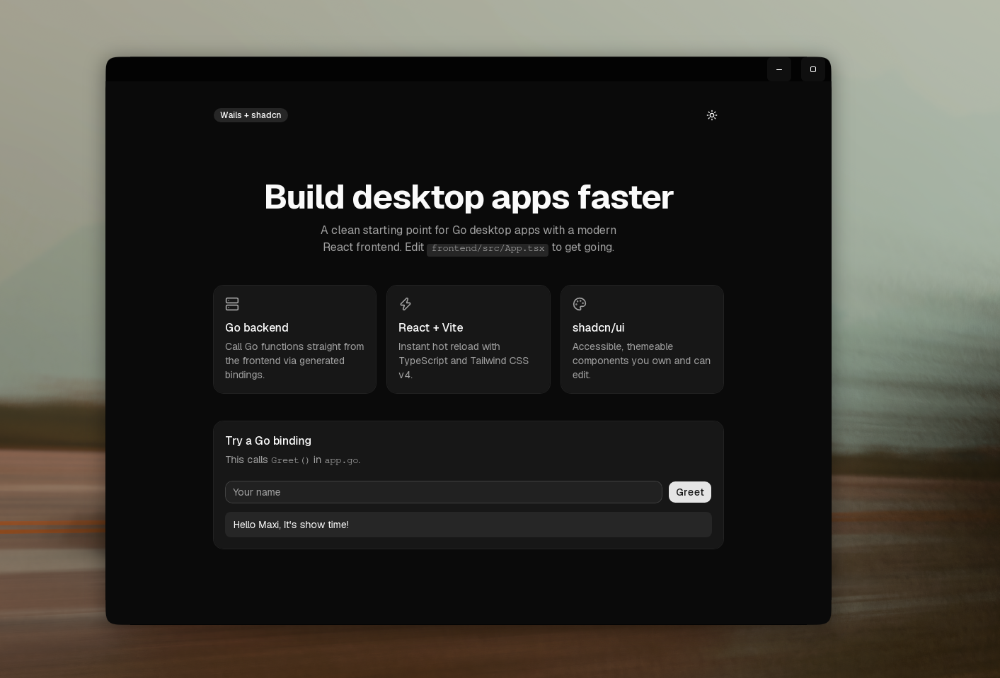

# Shelf

A minimal starter for desktop apps built with **Go**, **Wails v2**, **React**, **TypeScript**, **Tailwind CSS v4** and **shadcn/ui**.



## Features

- Go backend with auto-generated TypeScript bindings
- React + Vite frontend with hot reload
- shadcn/ui components with light and dark mode
- `make` shortcuts for dev and build
- Works on Linux, Windows and macOS

## Prerequisites

- [Go](https://go.dev/dl/) 1.21+
- [Node.js](https://nodejs.org/) 18+
- Wails CLI:

```bash
  go install github.com/wailsapp/wails/v2/cmd/wails@latest
```

- Linux only: GTK and WebKit

```bash
  # Arch
  sudo pacman -S gtk3 webkit2gtk-4.1
  # Debian/Ubuntu
  sudo apt install libgtk-3-dev libwebkit2gtk-4.1-dev
```

Run `wails doctor` to check that everything is set up.

## Getting started

1. Click **Use this template** on GitHub, or clone the repo directly:

```bash
   git clone https://github.com/0xby7eMe/wails-shadcn-template my-app
   cd my-app
```

2. Rename the project (see [Renaming](#renaming)).

3. Install frontend dependencies:

```bash
   cd frontend && npm install && cd ..
```

4. Start the dev server:

```bash
   make dev
```

## Commands

| Command | Description |
| --- | --- |
| `make dev` | Run the app with hot reload |
| `make build` | Build a production binary into `build/bin/` |
| `npx shadcn@latest add <component>` | Add a shadcn component (run in `frontend/`) |

On Windows without `make`, use `wails dev` and `wails build` directly.
On Linux, add `-tags webkit2_41` to those commands.

## Project structure

```
.
├── app.go               # Go methods exposed to the frontend
├── main.go              # Wails entry point and window config
├── wails.json           # Wails project config
├── Makefile
└── frontend/
    ├── src/
    │   ├── components/ui/   # shadcn components
    │   ├── App.tsx
    │   └── style.css        # Tailwind entry
    └── wailsjs/             # Generated Go bindings (do not edit)
```

## Calling Go from the frontend

Add an exported method in `app.go`:

```go
func (a *App) Add(x, y int) int {
	return x + y
}
```

Then import it in React:

```tsx
import { Add } from "../wailsjs/go/main/App"

const sum = await Add(1, 2)
```

Bindings are regenerated automatically on `make dev`.

## Renaming

After creating a project from this template, run:

```bash
node scripts/rename.mjs my-app github.com/<your-user>/my-app
go mod tidy
```

This updates `go.mod`, `wails.json`, `frontend/package.json`, the window title and the README heading. Afterwards you can delete the `scripts/` folder and the `rename` target in the `Makefile`.

## CI and releases

Every push to `main` and every pull request builds the app for Linux, Windows and macOS. Download the binaries from the **Actions** tab under the run's artifacts.

To publish a release:

```bash
git tag v1.0.0
git push origin v1.0.0
```

The workflow attaches the zipped builds to a GitHub Release automatically.