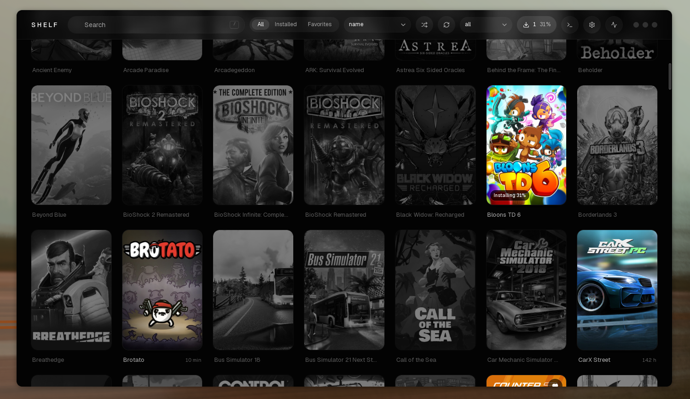
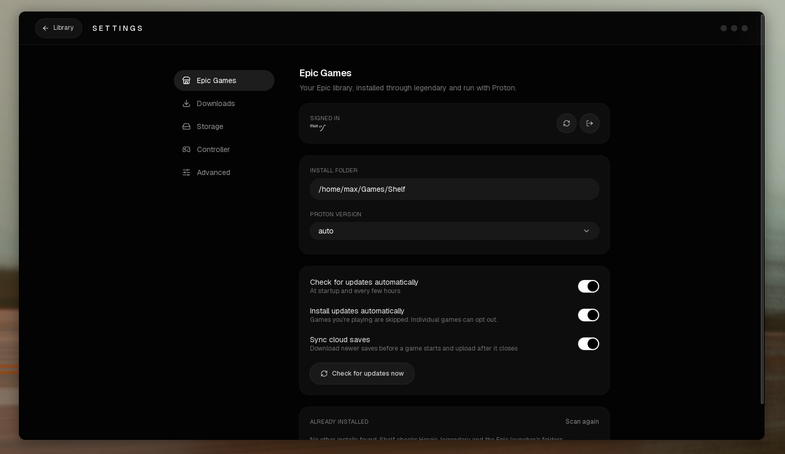
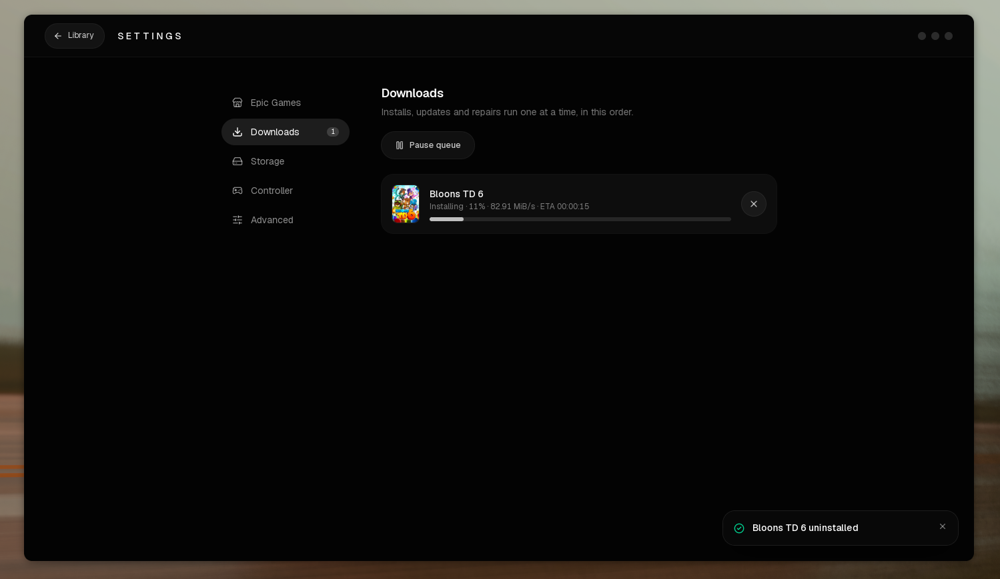

<div align="center">


# Shelf

A minimal, good-looking desktop library for your Steam, Epic Games and Ubisoft games.

[](https://github.com/0xby7eMe/shelf/actions/workflows/build.yml)
[](https://github.com/0xby7eMe/shelf/releases)

</div>

<p align="center">
  
</p>

<p align="center">
  
  
</p>

## Features

**Library**

- Reads your Steam library from its local files. No login, no API key.
- Your Epic Games library alongside it, after a one-time sign-in (see [Epic Games](#epic-games)).
- Your Ubisoft library too, read from Ubisoft Connect once you've signed in there (see [Ubisoft](#ubisoft)).
- Poster grid with instant search, installed and favorites filters, a store filter and sorting. Stays smooth with a couple of hundred games.
- Hero banner for the game you played last, plus "Continue playing" and "Never played" shelves
- Detail sheet with playtime, last played, share of your library, store page and install folder
- Favorites and a random game picker
- **Live library:** installs, uninstalls and playtime update automatically
- **Now playing:** a header indicator with a session timer
- **Activity:** a play-time heatmap and weekly stats, recorded while Shelf is running

**Epic Games**

- Install, update, verify, repair and uninstall games without leaving Shelf
- Launch through Proton with a separate prefix per game
- Cloud saves, per-game launch settings, and import of games you already have installed

**Ubisoft**

- Your whole Ubisoft library, installed or not, with Ubisoft's own poster and banner art
- Install, play and uninstall through Ubisoft Connect, which Shelf sets up and runs in its own Proton prefix
- Install progress, launch errors that say what went wrong, and a hint when the library is empty
- GE-Proton and the BattlEye runtime can be installed from Shelf with one button

**Everything else**

- Controller navigation with soft interface sounds, drawn with the buttons of your controller (Xbox, PlayStation or Nintendo)
- One **Integrations** page with a tab per store
- A download queue, a disk usage view, and a log window
- Frameless glass UI, dark only

<p align="center">
  
</p>

## Epic Games

Shelf drives [legendary](https://github.com/derrod/legendary), the same CLI Heroic uses, so it needs to be installed (Arch: `pacman -S legendary`). Shelf keeps its own legendary login, separate from any existing one.

1. Click the gear in the header, open **Integrations** and pick the **Epic Games** tab. Choose **Open Epic login**, sign in and paste the code Epic shows you.
2. Your Epic games appear in the library. Open one and press **Install**.
3. **Play** runs the game with Proton. Shelf finds Proton in Steam, `compatibilitytools.d` (GE-Proton) and Heroic's tools folder. Pick a version in the settings; by default the newest GE-Proton wins, then Proton Experimental.

<p align="center">
  
</p>

Games install to `~/Games/Shelf` (changeable), each with its own Proton prefix in `~/.local/share/shelf/prefixes`. Play time for Epic games is recorded while Shelf is running, since Epic doesn't provide it.

### Updates

Shelf checks for new versions at startup and every few hours, marks games that are behind and can install updates by itself. Both are switches in the Epic settings, and each game can opt in or out. Epic refuses to start an outdated game, so Shelf tells you when an update is needed. A game can also be allowed to launch outdated.

### Verify and repair

Check a game's files against Epic's manifest from its sheet. If anything is damaged or missing, repair downloads just those files again.

### Cloud saves

Newer saves are downloaded before a game starts and uploaded after it closes, or synced by hand from the sheet. Shelf finds the save folder inside the game's Proton prefix, and you can override it per game. A game has to be started once before its saves can sync. Only games that support cloud saves show the option.

### Per-game settings

Proton version, launch arguments, environment variables, MangoHud, GameMode, offline mode, whether outdated launches are allowed, and update and cloud save behavior. Each can follow the global setting.

### Existing installs

Games already installed by Heroic, legendary or the Epic Games Launcher are found and imported in place, with no download. Shelf only offers games that belong to your account.

### Games that can't be installed

Some Epic titles, such as Ubisoft Connect and EA app games, have to be installed through their own launcher, and Epic doesn't let other launchers download them. Shelf marks these in the game sheet instead of offering an install that can't work. If the game is also in your Ubisoft library, install it from there (see [Ubisoft](#ubisoft)).

## Ubisoft

Ubisoft has no command line tool like legendary, and its web login sits behind a bot check that only a real browser passes, so Shelf never asks for your Ubisoft password. Instead, [Ubisoft Connect](https://www.ubisoft.com/en-us/ubisoft-connect) itself is the account: Shelf installs it into a Proton prefix of its own, you sign in there once, and Shelf reads the library Connect records.

1. Click the gear, open **Integrations** and pick the **Ubisoft** tab. Press **Set up Ubisoft Connect**. Shelf downloads Ubisoft's installer and runs it quietly with Proton.
2. Press **Open Ubisoft Connect** and sign in, two-step verification included. Your games appear in Shelf on their own once Connect has loaded them. Until then the Ubisoft filter explains what is missing.
3. Open a game and press **Install**. Shelf hands the download to Connect and shows the game as installing, with how much has been written to disk (Connect reports no percentage). It counts as installed only when Connect marks it finished.
4. **Play** starts the game through Connect. If a game doesn't appear within two minutes, or Proton can't hand it over, Shelf says so and points at the game's log. **Uninstall** asks Connect to remove it; you confirm in Connect's window.

Games Ubisoft lists but that belong to Steam are shown in the library and left to Steam.

### GE-Proton

Ubisoft Connect behaves best with GE-Proton: black or frozen windows and slow game starts are the usual symptoms of other builds. If you aren't using it, the Ubisoft tab has an **Install GE-Proton** button. Shelf fetches the newest release from GitHub, checks its SHA-512, unpacks it into Steam's `compatibilitytools.d` (or Heroic's folder without Steam) and uses it from then on, unless you picked a build yourself. If Connect misbehaves after switching, **Reset** gives it a fresh prefix.

### BattlEye

Games that use BattlEye, such as Riders Republic, need Proton's BattlEye runtime to start. Shelf detects them from the game's folder, sets `PROTON_BATTLEYE_RUNTIME` when starting them (Epic games too), and refuses to launch them without it, saying what to do. The game's page offers **Install BattlEye runtime**, and so do the Epic and Ubisoft tabs. Steam's own "Proton BattlEye Runtime" is used if you have it. Otherwise Shelf downloads the same files Heroic and Lutris use, a 9 MB archive pinned to a known SHA-256, into `~/.local/share/shelf/runtimes`.

### Connect's window

Many setups draw Connect's own window black. **Fix a black Ubisoft Connect window** (on by default) uses software rendering for Connect's window only while you sign in and install. Playing a game restarts Connect normally, so games never use it.

## Downloads and storage

Installs, updates and repairs run one at a time. **Settings, Downloads** shows the queue: reorder it, send a game to the front, cancel entries or pause the queue. "Update all" queues every outdated game.

Ubisoft downloads are done by Connect, so they aren't in this queue; they show as installing on the game instead.

**Settings, Storage** shows how much space each Steam, Epic and Ubisoft game uses, free space per disk, and Proton prefixes, including leftovers from uninstalled games that you can delete. Ubisoft's games are installed inside one shared Connect prefix, so that is listed on its own with the games' space taken off, and is never offered as a leftover: **Reset** there deletes Connect's login and every Ubisoft game, and says so first.

<p align="center">
  
  
</p>

## Controller

Plug in a gamepad and press any button (the window needs focus). Focus moves smoothly between games, and the interface plays soft sounds as you go.

Shelf tells which kind of controller you have, by its USB vendor id, and shows the buttons it really has: coloured A/B/X/Y for Xbox, ✕ ○ □ △ for PlayStation, and Nintendo's layout with A and B swapped. Anything unknown is treated as an Xbox pad.

| Action | Xbox | PlayStation | Nintendo |
| --- | --- | --- | --- |
| Move | D-pad / left stick | D-pad / left stick | D-pad / left stick |
| Select | `A` | ✕ | `B` |
| Back, or close the open dialog | `B` | ○ | `A` |
| Favorite | `X` | □ | `Y` |
| Random game | `Y` | △ | `X` |
| Switch tabs | `LB` / `RB` | `L1` / `R1` | `L` / `R` |
| Settings | Menu | Options | `+` |
| Search | View | Create | `−` |
| Scroll | Right stick | Right stick | Right stick |

The sounds are Steam's own Deck UI sounds, played from your Steam install (nothing is copied or bundled). Without Steam, Shelf uses a small built-in set instead. Navigation, sounds and volume are under **Settings, Controller**. Dialogs and menus trap the focus, so the controller never wanders behind them.

## Log window

**Settings, Advanced** turns on a log window: a console along the bottom of the window with live output from downloads, updates, game launches and cloud saves, including the commands that were run. Filter it, copy it or clear it. It opens by itself when a game fails to start. Each game's launch output is also written to `~/.local/share/shelf/logs`, whether or not the window is on.


## Keyboard

| Key | Action |
| --- | --- |
| `/` | Focus search |
| `Esc` | Clear search, or leave the settings page |
| `R` | Open a random game from the current view |

## Install

### From a release

Download `shelf-linux-amd64.tar.gz` from the [releases page](https://github.com/0xby7eMe/shelf/releases), then:

```bash
tar -xzf shelf-linux-amd64.tar.gz
install -Dm755 shelf ~/.local/bin/shelf
install -Dm644 appicon.png ~/.local/share/icons/hicolor/512x512/apps/shelf.png
install -Dm644 shelf.desktop ~/.local/share/applications/shelf.desktop
```

The binary needs GTK 3 and WebKitGTK 4.1 at runtime:

```bash
# Arch
sudo pacman -S gtk3 webkit2gtk-4.1
# Debian/Ubuntu
sudo apt install libgtk-3-0 libwebkit2gtk-4.1-0
```

For Epic Games you also need legendary, and a Proton build from Steam or ProtonUp-Qt:

```bash
# Arch
sudo pacman -S legendary
```

Ubisoft needs only a Proton build. Shelf can install GE-Proton for you from the Ubisoft tab.

Controller support relies on WebKitGTK being built with gamepad support (libmanette), which is the case on Arch.

### AppImage

`shelf-linux-x86_64.AppImage` runs on most distros, including Ubuntu 22.04 and later, with GTK and WebKitGTK bundled, so nothing else needs installing:

```bash
chmod +x shelf-linux-x86_64.AppImage
./shelf-linux-x86_64.AppImage
```

For Epic Games you still need `legendary` and a Proton build on the system. Ubisoft needs only Proton.

### From source

Requires Go 1.25+, Node 18+ and the [Wails CLI](https://wails.io), plus the development packages:

```bash
# Arch
sudo pacman -S gtk3 webkit2gtk-4.1
# Debian/Ubuntu
sudo apt install libgtk-3-dev libwebkit2gtk-4.1-dev
```

```bash
git clone https://github.com/0xby7eMe/shelf
cd shelf
cd frontend && npm install && cd ..
make install
```

`make install` builds the app and installs the binary, icon and launcher entry for your user.

## Development

```bash
make dev      # run with hot reload
make build    # production binary in build/bin/
go test ./internal/...
```

## How it works

**Steam.** Shelf parses Steam's own files: `libraryfolders.vdf` for your library locations, the `appmanifest_*.acf` files for installed games and `localconfig.vdf` for playtime. A file watcher reloads the library when they change. Cover and hero art come from Steam's local library cache, with the Steam CDN as a fallback. "Now playing" looks for Steam's `SteamLaunch` wrapper process in `/proc`.

**Epic.** Shelf runs legendary with its own config folder and reads its files for the library and installed games. Games start as `legendary launch` with Proton as the wrapper, with `STEAM_COMPAT_DATA_PATH` pointing at the game's own prefix. Legendary exits right after starting the game, so "now playing" finds the game by the `-epicapp=<name>` argument on its processes. Downloads are one legendary process at a time, with progress read from its output.

**Ubisoft.** Shelf runs Ubisoft Connect through Proton in its own prefix and reads what Connect writes there: `cache/configuration/configurations` (every game it knows, with names and art) and `cache/ownership/<account id>` (the ids your account owns), both protobuf. The library is the games in both. Poster and banner art come from Ubisoft's launcher CDN. Install, uninstall and play are `uplay://` links handed to Connect through `proton run start`. Connect's registry marks the start of a download with an `Installs` key and its end with an `Uninstall` key, which is how Shelf tells installing from installed. Games are found running by their install folder in the process list.

Finished sessions of every store feed the activity heatmap.

| Data | Location |
| --- | --- |
| Favorites | `~/.config/shelf/favorites.json` |
| Play sessions | `~/.config/shelf/sessions.json` |
| Epic settings | `~/.config/shelf/epic.json` and `epic-games.json` (per game) |
| Epic login and metadata | `~/.config/shelf/legendary` |
| Proton prefixes (Ubisoft's is `ubisoft-connect`) | `~/.local/share/shelf/prefixes` |
| BattlEye runtime (downloaded by Shelf) | `~/.local/share/shelf/runtimes/battleye_runtime` |
| GE-Proton (installed by Shelf) | `compatibilitytools.d` in your Steam folder |
| Game launch logs | `~/.local/share/shelf/logs` |
| Downloaded art | `~/.cache/shelf/covers` |

Built with Go, [Wails v2](https://wails.io), React, Tailwind CSS v4 and shadcn/ui.

## Limitations

- Linux only for now. The Steam provider only knows Linux paths, including the Flatpak one.
- Only installed Steam games are listed, because Steam doesn't store names of uninstalled games locally. Epic shows your whole library.
- "Now playing" and session history work with native Steam, not the Flatpak version.
- Sessions are only recorded while Shelf is open, so the heatmap fills from first use. Playtime from Steam can lag until Steam writes its files, and Epic playtime counts only what Shelf saw.
- Epic needs legendary and a Proton build. Epic games that must be installed through Ubisoft Connect or the EA app can't be installed from the Epic side.
- Ubisoft can't be signed in from Shelf: you sign in inside Connect once, and Shelf reads the library from it. Connect's files are only read, never changed. The reading is built from Connect's current file format and tested against one account, so please open an issue if your library comes out empty.
- Ubisoft installs show activity and bytes written, not a percentage or time left, and can't be cancelled from Shelf. Playing or restarting Connect during a download is refused, since it would end the download.
- Ubisoft's play time is counted only while Shelf sees the game running, as with Epic.
- The download queue is kept in memory only, so it's empty after a restart. A cancelled download resumes where it stopped.
- Cloud saves rely on legendary finding the save folder in the game's Proton prefix. If it can't, set the save folder in the game's settings.
- Controller sounds depend on the webview allowing audio, which can need one click or key press after launch.
